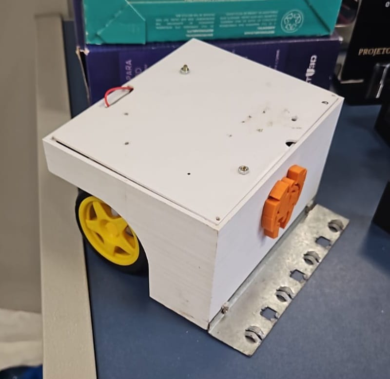

# YukiBot

**YukiBot** é um robô de sumô desenvolvido pelo **Grupo 1** durante o **Processo Seletivo 2024.2** da **Equipe Titans**. O robô é controlado usando um aplicativo mobile chamado Dabble, utilizando o protocolo Bluetooth.

**Estrutura**:  
Chassis feito em PLA branco, com uma rampa feita com uma chapa de alumínio que foi parafusada a estrutura do robô. O chassis tem 3 compartimentos internos para inserir pesos para aumentar o peso do robô, um compartimento para a bateria e dois suportes para encaixe dos motores, que foram presos a estrutura a partir de abraçadeiras.

**Eletrônica**:  
O sistema eletrônico do Yukibot é baseado em volta do microcontrolador Esp32, que controla os motores por sinais enviados para a ponte H através de comandos recebidos via bluetooth. O sistema é alimentado com três baterias de lítio de 3.7V colocadas em série, o que resulta numa fonte de tensão constante de ~12V. Essa tensão de 12V é usada para alimentar o módulo ponte H L298N diretamente e serve de entrada para um regulador de tensão que fornece 5V para a Esp através do pino de Vin. O regulador consiste de um 7805 com um capacitor de 330nF entre sua entrada e ground e um capacitor de 100nF entre a saída e ground, de acordo com o datasheet do fabricante, para evitar picos de tensão que danifiquem a Esp, havendo também um capacitor de 100nF entre o pino Vin e Gnd do microcontrolador para aumentar a proteção contra picos de tensão. Na placa há um led verde para indicar que o 7805 está fornecendo 5V para a Esp e outros três leds para verificar o uso de saídas digitais através de sinais bluetooth.
